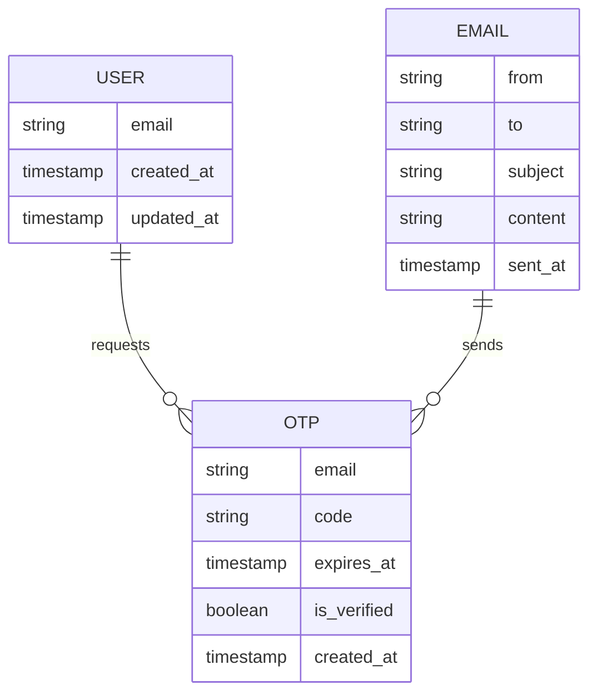
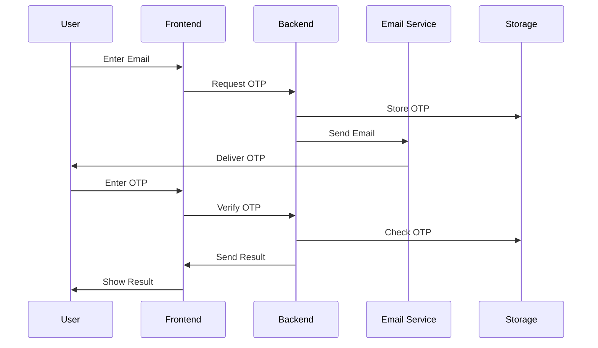

# Email OTP Verification System

A modern, secure, and user-friendly email OTP (One-Time Password) verification system built with Next.js 13+, TypeScript, and Tailwind CSS.

## 🌟 Features

- **Email OTP Verification**: Secure two-step verification process
- **Modern UI**: Clean and responsive design using Tailwind CSS
- **Type Safety**: Built with TypeScript for better development experience
- **Real-time Feedback**: Immediate user feedback for all actions
- **Security**: 5-minute OTP expiration
- **Email Integration**: Powered by Resend for reliable email delivery

## 🚀 Getting Started

### Prerequisites

- [nvm](https://github.com/nvm-sh/nvm) (Node Version Manager)
- npm or yarn
- A Resend account and API key

### Installation

1. Install and use the correct Node.js version:
```bash
# Install Node.js 20
nvm install 20

# Use Node.js 20
nvm use 20

# Verify the version
node --version
```

2. Clone the repository:
```bash
git clone <your-repository-url>
cd email-otp-next
```

3. Install dependencies:
```bash
npm install
# or
yarn install
```

4. Create a `.env.local` file in the root directory and add your Resend API key:
```env
RESEND_API_KEY=re_your_api_key_here
```

5. Start the development server:
```bash
npm run dev
# or
yarn dev
```

6. Open [http://localhost:3000](http://localhost:3000) in your browser.

## 🚀 Deployment

### Deploying to Vercel

1. **Prepare Your Project**
   ```bash
   # Make sure all changes are committed
   git add .
   git commit -m "Ready for deployment"
   ```

2. **Install Vercel CLI** (optional, for local deployment testing)
   ```bash
   npm install -g vercel
   ```

3. **Deploy to Vercel**

   **Option 1: Using Vercel Dashboard (Recommended)**
   1. Push your code to GitHub
   2. Go to [Vercel Dashboard](https://vercel.com/dashboard)
   3. Click "New Project"
   4. Import your repository
   5. Configure your project:
      - Framework Preset: Next.js
      - Root Directory: ./
      - Build Command: `next build`
      - Output Directory: .next
   6. Add Environment Variables:
      - Go to Project Settings > Environment Variables
      - Add `RESEND_API_KEY` with your Resend API key
   7. Click "Deploy"

   **Option 2: Using Vercel CLI**
   ```bash
   # Login to Vercel
   vercel login

   # Deploy
   vercel

   # For production deployment
   vercel --prod
   ```

4. **Post-Deployment**
   - Verify your domain settings
   - Test the OTP functionality
   - Monitor the deployment logs
   - Set up custom domain (optional)

### Environment Variables in Vercel

1. Go to your project in Vercel Dashboard
2. Navigate to Settings > Environment Variables
3. Add the following variables:
   ```
   RESEND_API_KEY=re_your_api_key_here
   ```

### Deployment Checklist

- [ ] All environment variables are set in Vercel
- [ ] Resend API key is properly configured
- [ ] Email templates are tested
- [ ] OTP verification flow is working
- [ ] Error handling is properly implemented
- [ ] Rate limiting is configured (if needed)
- [ ] Custom domain is set up (if needed)

### Troubleshooting Deployment

1. **Build Failures**
   - Check build logs in Vercel dashboard
   - Verify all dependencies are in package.json
   - Ensure TypeScript compilation is successful

2. **Runtime Errors**
   - Check Vercel function logs
   - Verify environment variables
   - Test API endpoints

3. **Email Delivery Issues**
   - Verify Resend API key
   - Check email template formatting
   - Test email delivery in development

4. **Common Issues**
   - CORS configuration
   - API route handling
   - Environment variable access
   - Build optimization

For more detailed deployment information, visit [Vercel's Next.js Deployment Guide](https://vercel.com/docs/frameworks/nextjs).

## 🛠️ Tech Stack

- **Framework**: Next.js 13+ (App Router)
- **Language**: TypeScript
- **Styling**: Tailwind CSS
- **Email Service**: Resend
- **State Management**: React Hooks
- **Form Handling**: Native React forms

## 📁 Project Structure

```
email-otp-next/
├── src/
│   ├── app/
│   │   ├── api/
│   │   │   ├── send-otp/
│   │   │   │   └── route.ts
│   │   │   └── verify-otp/
│   │   │       └── route.ts
│   │   ├── pages/
│   │   │   └── index.tsx
│   │   └── utils/
│   │       └── otpStore.ts
│   └── styles/
├── public/
├── .env.local
└── package.json
```

## 🔒 Security Features

- OTP expiration after 5 minutes
- Input validation and sanitization
- Secure API endpoints
- Environment variable protection
- Rate limiting (can be implemented)

## 📧 Email Template

The system sends professionally formatted emails with:
- Clear OTP display
- Expiration notice
- Security warnings
- Responsive design
- Emoji indicators for better UX

## 🎨 UI/UX Features

- Responsive design for all devices
- Clear success/error messages
- Loading states
- Input validation
- Modern, clean interface
- Accessible form elements

## 🔧 Configuration

### Environment Variables

Create a `.env.local` file with:
```env
RESEND_API_KEY=your_resend_api_key
```

### Customization

You can customize:
- OTP length (default: 6 digits)
- Expiration time (default: 5 minutes)
- Email template
- UI colors and styling
- Success/error messages

## 🧪 Testing

To run tests:
```bash
npm run test
# or
yarn test
```

## 📝 API Endpoints

### Send OTP
- **Endpoint**: `/api/send-otp`
- **Method**: POST
- **Body**: `{ email: string }`
- **Response**: `{ success: boolean }`

### Verify OTP
- **Endpoint**: `/api/verify-otp`
- **Method**: POST
- **Body**: `{ email: string, code: string }`
- **Response**: `{ success: boolean }`

## 👥 Authors

- Priya Joshi

## 🙏 Acknowledgments

- [Next.js](https://nextjs.org/)
- [Tailwind CSS](https://tailwindcss.com/)
- [Resend](https://resend.com/)
- [TypeScript](https://www.typescriptlang.org/)

## 📞 Support

For support, email priyajoshi.pj.22@example.com or open an issue in the repository.

## 📊 System Architecture & ERD

### Entity Relationship Diagram



### Component Flow



### Key Components

1. **User Interface**
   - Email input form
   - OTP verification form
   - Status messages
   - Loading states

2. **Resend Library**
   - OTP Generation Service
   - Email Service (Resend)
   - Verification Service
   - Storage Service

3. **In Memory Storage**
   - OTP Records
   - User Sessions
   - Email Templates

4. **Security Layer**
   - Rate Limiting
   - Input Validation
   - Token Management
   - Expiration Handling
